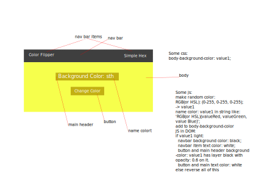

# Update change in code

## Attached

- 

## 21/9/2021

- [ ] change RGB color to [HSL](https://www.w3schools.com/colors/colors_hsl.asp). Because HSL has value L representation of lightness we can use it to ez decoration navbar, navitem, button, main text to light color (L >= 50) or dark color (L < 50>). **Thanh Notice!**
- [x] change hex-color element (top-right of page) to dropdown element contain HEX, RGB and change id to 'dropdown-color'.
